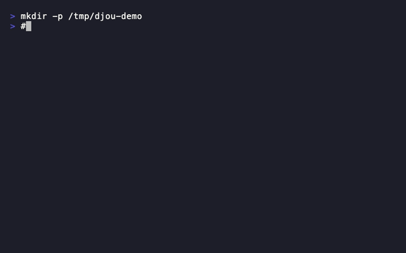

# djou - Dev Journal CLI

[](https://github.com/kca2250/dev-journal/actions/workflows/ci.yml)
[](https://github.com/kca2250/dev-journal/releases)
[](https://opensource.org/licenses/MIT)
[](https://goreportcard.com/report/github.com/kca2250/dev-journal)

A CLI tool for recording and managing your development journal.



## Overview

djou helps you track your daily development work by recording both quantitative data (work time, AI usage time) and qualitative data (learnings, blockers).

- Interactive form for easy input
- Quick record mode for fast logging
- Search, aggregate, and export your data
- MCP server for AI assistant integration

## Installation

### Homebrew (macOS/Linux)

```bash
brew tap kca2250/tap
brew install djou
```

### Go Install

```bash
go install github.com/kca2250/djou/cmd/djou@latest
```

### Download Binary

Download from [GitHub Releases](https://github.com/kca2250/dev-journal/releases).

## Quick Start

```bash
# Record a new entry (interactive)
djou record

# Quick record (one-liner)
djou record -q "Implemented login feature" -e 2 -a 3 -ai 30

# List recent entries
djou list

# Search entries
djou search "authentication"

# View statistics
djou stats
```

## Commands

| Command | Description |
|---------|-------------|
| `djou record` | Record a new development journal entry |
| `djou list` | List recorded entries |
| `djou search` | Search entries by keyword |
| `djou stats` | Show statistics |
| `djou export` | Export entries to CSV/JSON |
| `djou config` | Manage configuration |
| `djou version` | Show version information |
| `djou mcp` | Start MCP server |

## Usage

### Record (`djou record`)

Interactive form to record your development journal.

```bash
$ djou record

? Task name: Login screen implementation
? Estimate (h): 2
? Actual (h): 3
? AI usage (min): 30
? Tags: feature, frontend
? Blocker: CORS error
? Solution: Added proxy configuration
? Learning: Check API integration early

✅ Recorded!
```

#### Quick Record Mode

```bash
djou record -q "Task name" -e 2 -a 3 -ai 30 -t "tag1,tag2"
```

### List (`djou list`)

```bash
# Recent 10 entries (default)
djou list

# This week's entries
djou list --week

# This month's entries
djou list --month

# With details
djou list --detail
```

### Search (`djou search`)

```bash
# Keyword search
djou search "CORS"

# Multiple keywords (AND search)
djou search "CORS" "error"

# With details
djou search "API" --detail
```

### Statistics (`djou stats`)

```bash
# Overall statistics
djou stats

# Monthly statistics
djou stats --month
```

### Export (`djou export`)

```bash
# Export to CSV
djou export

# Export to JSON
djou export --format json

# Specify output directory
djou export --output ./reports
```

## MCP Server

djou includes an MCP (Model Context Protocol) server for AI assistant integration.

### Supported Tools

| Tool | Support |
|------|---------|
| [Claude Code](https://docs.anthropic.com/en/docs/claude-code) | ✅ |
| [Claude Desktop](https://claude.ai/download) | ✅ |
| [Cursor](https://cursor.sh/) | ✅ |
| [Cline](https://github.com/cline/cline) | ✅ |

### Setup

#### Claude Code

Add to `~/.claude/claude_code_config.json`:

```json
{
  "mcpServers": {
    "djou": {
      "command": "djou",
      "args": ["mcp"]
    }
  }
}
```

#### Claude Desktop

Add to `~/Library/Application Support/Claude/claude_desktop_config.json` (macOS) or `%APPDATA%\Claude\claude_desktop_config.json` (Windows):

```json
{
  "mcpServers": {
    "djou": {
      "command": "djou",
      "args": ["mcp"]
    }
  }
}
```

#### Cursor

Add to Cursor Settings → MCP → Add Server:

```json
{
  "djou": {
    "command": "djou",
    "args": ["mcp"]
  }
}
```

#### Cline (VS Code)

Add to Cline MCP settings:

```json
{
  "mcpServers": {
    "djou": {
      "command": "djou",
      "args": ["mcp"]
    }
  }
}
```

### Available MCP Tools

| Tool | Description |
|------|-------------|
| `create_record` | Create a new journal entry |
| `get_records` | Get journal entries with filters |
| `update_record` | Update an existing entry |
| `delete_record` | Delete an entry |

### Usage Example

Once configured, you can ask your AI assistant:

- "Record that I worked on the login feature for 2 hours"
- "Show my journal entries from this week"
- "What did I learn yesterday?"

## Configuration

### Initialize Config

```bash
# Create config file
djou config init

# Show current config
djou config show

# Edit config file
djou config edit
```

### Config File Location

```
~/.djou/config.yaml
```

### Language

Language is automatically detected from the `LANG` environment variable.

```bash
# Use English
LANG=en_US.UTF-8 djou list

# Use Japanese
LANG=ja_JP.UTF-8 djou list
```

## Data Storage

```
~/.djou/djou.db (SQLite)
```

## Tech Stack

| Component | Technology |
|-----------|------------|
| Language | Go |
| Database | SQLite |
| Interactive UI | [charmbracelet/huh](https://github.com/charmbracelet/huh) |
| CLI Framework | [spf13/cobra](https://github.com/spf13/cobra) |

## Contributing

See [CONTRIBUTING.md](CONTRIBUTING.md) for guidelines.

## License

[MIT License](LICENSE)
